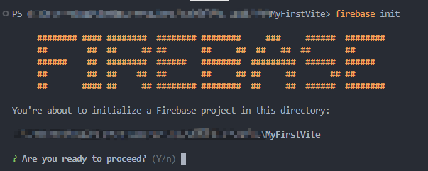
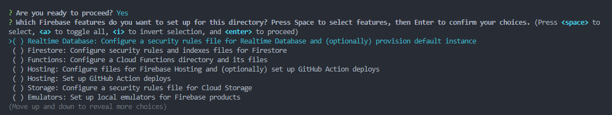
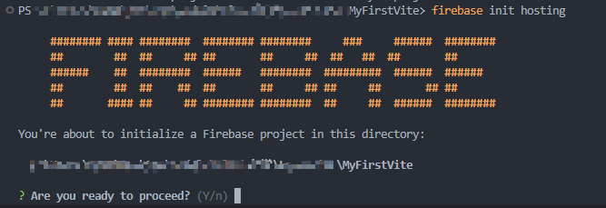
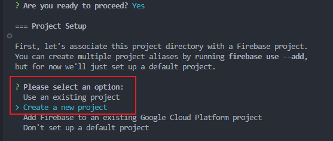
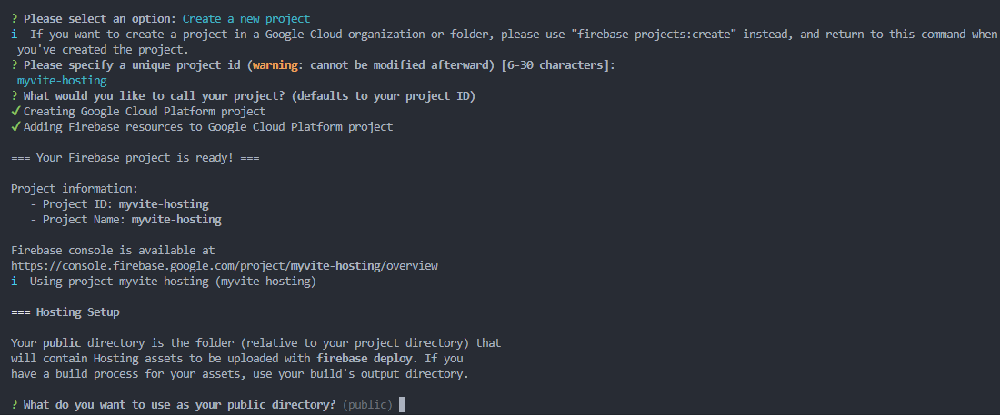
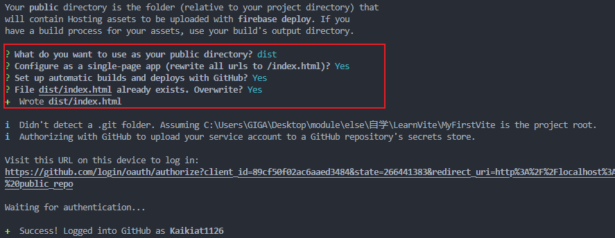
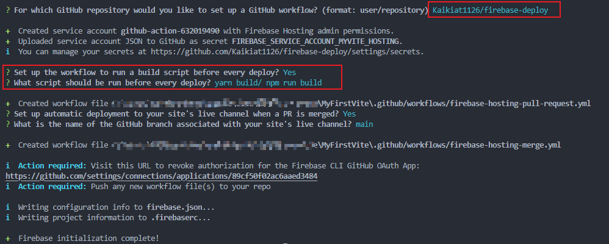
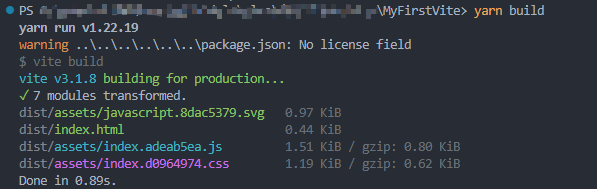
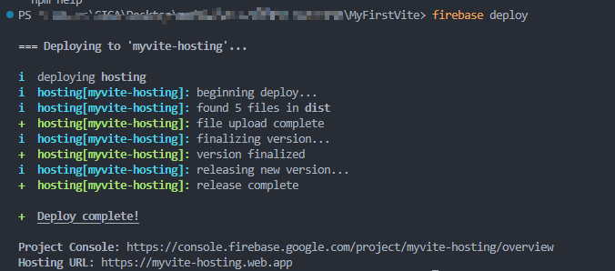
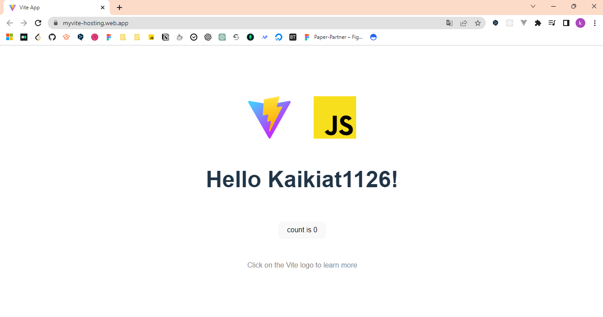

# 0421-firebase-deploy

## How to deploy a Vue Project with using Firebase?

1. Make sure already install `Node.js` and `firebase` in global

```bash
$ npm install -g firebase-tools
#or
$ yarn add -g firebase-tools
```

2. Connect to your firebase account

```bash
$ firebase login
```

3. Login and initialize firebase in your project

```bash
$ firebase init
```

4. Ready to proceed and switch to the Hosting section





```bash
#or 

$ firebase init hosting
```



5. Create a new firebase project for your project or you can choose the current existing project.





5. You will be asked which one to use as the startup directory, so instead of the default public, write `dist`  Since `npm run build`/ `yarn build`, the `dist` directory is created when you build your project (Vue/React). If you have already created a `dist` directory, the files will still be placed in this directory after packaging.
6. Choose rewrite `index.html` with input `y`, even exist or not, also choose `y`



7. Choose a GitHub repository for this project and setup the CI/CD settings



8. Until here the firebase initialize was done, now run the `npm run build` or `yarn build` in terminal to build the project.



9.  Run `firebase deploy` in the terminal to start the hosting

```bash
$ firebase deploy
```



10. Follow the Hosting URL given here to visit your project!



11. You may also visit the `firebase console` to view your project information.
